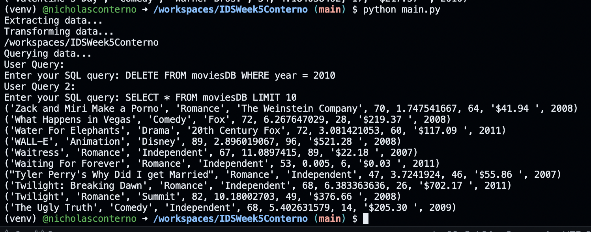
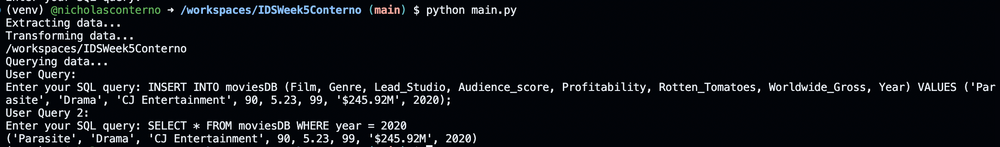

# Overview
Made a database with full CRUD operations.

## Show Proof of Delete

## Show Proof of Update

Note that Create is proven by the fact that the table exists to be updates and deleted. Similarly read is being shown when I do\
Select* to show that my Delete and Update worked.